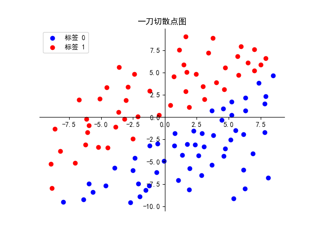
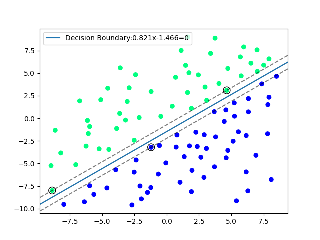

# 小A创新创业团队AI组考核一

>**本次考核主要内容为机器学习基础、数据可视化、<mark>pytorch基本用法（选择性学习）**

2025/3/16 AI组全体成员

## 1 时间安排
<mark>一轮考核：3月17号~3月23号

在3月21号晚上会有一个分享学习会(暂定)

### 2 基础任务<mark>（必做）

### 2.1 任务描述

在压缩文件中的<mark>data</mark>文件夹中包含了“一刀切”散点的训练集train.csv和测试集test.csv文件。其中train.csv的可视化图像如下图所示：

> 在两个csv文件中第一行和第二行是特征(也就是二维坐标轴上的点)，第三行数标签(二分类0和1)

### 2.2 任务要求

1. 请你使用train.csv文件画出上述任务描述中的一刀切型散点图

2. 请你使用经典的机器学习分类算法运用训练集(train.csv)的数据训练出一个分类器。

3. 将测试集(test.csv)的数据代入训练好的SVM分类器，要求准确率达到<mark>90%

下图是使用支持向量机找到的超平面训练出来的分类器

### 2.3 参考资料

- 正规矩阵法：[参考博客](https://blog.csdn.net/weixin_45252110/article/details/97310655)

- sklearn安装下载：[skleanrn是经典的机器学习工具](https://zhuanlan.zhihu.com/p/105039597)

- AI工具1：[deepseek](https://www.deepseek.com/)

- AI工具2：[kimi](https://kimi.moonshot.cn/)

## 3 进阶任务<mark>（选做）

数据存放在<mark>data</mark>文件夹中的“gandou.csv”文件中，包含了16个特征信息和1个标签信息，同时是一个4分类问题。

### 3.1 任务要求：

1. 数据集的划分，你需要将数据划分为训练集和测试集
2. <mark> 数据清洗

3. 你需要使用pytorch训练出一个分类器,要求<mark>测试集的准确率达到80%以上

4. 你必须使用<mark>pytorch或者其他的深度学习框架！！！

### 3.2 参考资料

- Pytorch学习视频：[PyTorch深度学习快速入门教程（p20~p24线性层)](https://www.bilibili.com/video/BV1hE411t7RN?p=20&vd_source=548b6a518766a20698f51072efce5936)
- [Pytorch官方英文文档](https://pytorch.org/docs/master/torch.html)
- [Pytorch中文文档](https://pytorch-cn.readthedocs.io/zh/latest/)

### 2.2 深度学习的理论基础

- 吴恩达深度学习：[[双语字幕]吴恩达深度学习deeplearning.ai](https://www.bilibili.com/video/BV1FT4y1E74V)

###  2.3 神经网络描述
- [神经网络博客](https://blog.csdn.net/illikang/article/details/82019945)

>任务驱动，挑着来看，上述只是参考资料，并不是绝对的，要学会理解机器学习。

## 4 提交要求

- 请上传使用markdown，Latex编辑的pdf文档或者jupyter notebook编辑的ipynb文档（不会上述工具word也行）

- 在文档中可以填写一些自己对于算法的感想以及遇到的代码bug(准确来说就是你是怎么完成上述的考核)

- 请提交<mark>准确率截屏

- <mark>上传源码

- 保存的模型可以不用上传。

>tips: 这里提醒一点，善于运用搜索引擎以及AI工具，而且要理解每一行代码，你为什么要这么干。